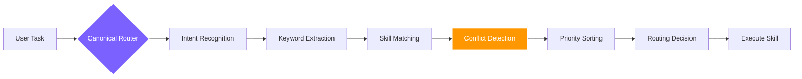

<div align="right">
  <b>🇬🇧 English</b> | <a href="./README.md">🇨🇳 中文</a>
</div>

<div align="center">
  <a href="https://github.com/foryourhealth111-pixel/Vibe-Skills">
    
  </a>

  <p align="center">
    <a href="https://github.com/foryourhealth111-pixel/Vibe-Skills/stargazers">
      
    </a>
    <a href="https://github.com/foryourhealth111-pixel/Vibe-Skills/network/members">
      
    </a>
    <a href="https://github.com/foryourhealth111-pixel/Vibe-Skills/pulse">
      
    </a>
    <a href="https://gitcgr.com/foryourhealth111-pixel/Vibe-Skills">
      
    </a>
  </p>


  <p align="center">
    
    
    
  </p>

  <br/>

  <h3 align="center"><b>More than a skill collection. It is your personal AI operating system.</b></h3>
  <p align="center">
    An industrial-grade runtime framework integrating hundreds of Skills, MCP entry points, and governance rules.
  </p>

  <p align="center">
    <sub>🧠 Planning · 🛠️ Engineering · 🤖 AI · 🔬 Research · 🧬 Life Sciences · 🎨 Visualization · 🎬 Multimedia</sub>
  </p>
</div>

---

<br/>

> [!IMPORTANT]
> **🎯 Our core vision:**
> Reduce the cognitive anxiety and high learning cost that come with every new technology wave. Here, whether or not you have a deep programming background, you can directly call on today's most advanced AI capabilities with an extremely low barrier to entry. **Let everyone enjoy the productivity leap that AI can bring.**

### 📊 Why is it so powerful?

**VibeSkills** runs on **VCO**. It is not a one-off utility or a script that only knows how to patch code. It is a highly integrated and governed **super-capability network**:

|                                                                 🧩 Skill Modules                                                                 |                                                           🌍 Ecosystem Integration                                                           |                                                                     ⚖️ Governance Rules                                                                     |
| :----------------------------------------------------------------------------------------------------------------------------------------------: | :------------------------------------------------------------------------------------------------------------------------------------------: | :---------------------------------------------------------------------------------------------------------------------------------------------------------: |
| <h2 align="center">340+</h2><div align="center">Directly callable Skills, covering the full chain from requirement planning to Execution. </div> | <h2 align="center">19+</h2><div align="center">High-value upstream open-source projects and best-practice sources absorbed and adapted</div> | <h2 align="center">129</h2><div align="center">Configuration-based policies and contracts to keep execution stable, traceable, and resistant to drift</div> |

---

## ✨ Why is it different?

Traditional Skills repositories answer: _"What tools do I have here?"_ VibeSkills goes straight after the core pain point of serious AI users: _"How do I finish work reliably?"_

| ❌ Traditional pain points you may have lived through                                                                                                                                                                                        | ✅ The VibeSkills answer we are building                                                                                                                                                                                                                                                                                    |
| :------------------------------------------------------------------------------------------------------------------------------------------------------------------------------------------------------------------------------------------- | :-------------------------------------------------------------------------------------------------------------------------------------------------------------------------------------------------------------------------------------------------------------------------------------------------------------------------- |
| **Sleeping skills**: hundreds of capabilities sit in the repo, but in real scenarios the AI does not remember to use them. Activation stays low.                                                                                             | **🧠 Intelligent routing**: the system figures out what to call based on context and logic, so you do not need to memorize a skill catalog.                                                                                                                                                                                 |
| **Black-box sprinting**: the AI starts building before clarifying requirements. It looks fast, but the direction drifts, and the project slowly turns into a black box.                                                                      | **🧭 Governed workflow**: the sequence is constrained on purpose. Clarification, verification, and traceability are folded into one unified flow, and every step stays auditable.                                                                                                                                           |
| **Conflicting components**: plugins and workflows fight each other, pollute the environment, or fall into loops because nobody is coordinating them.                                                                                         | **🧩 Global governance**: 129 contract rules define safety boundaries and rollback mechanisms, protecting the runtime's long-term stability.                                                                                                                                                                                |
| Messy Workspaces: AI workspaces often lack standardization. Over time, repositories become cluttered, hindering the next agent from taking over. Re-evaluating the architecture for a new agent leads to missed details and broken handoffs. | Semantic Directory Governance: Employs a standardized file storage architecture. It ensures that any work processed through this system is strictly organized, allowing the AI in subsequent sessions to instantly understand what files belong in which directories 👆.                                                    |
| AI Quirks & Illusions: Deleting primary files by mistake when clearing backups; a bad habit of writing silent fallback mechanisms, then confidently claiming early success while the primary functionality is actually quite poor.           | Built-in Guardrails: Includes strict rules, such as prohibiting bulk file deletion via commands (forcing one-by-one deletion to prevent accidents). Silent automated fallbacks are banned; any necessary fallback must trigger an explicit warning to the user 👆.                                                          |
| High Cognitive Load: Users must rely on their own experience to regulate AI workflows, requiring steep learning curves and constant vigilance.                                                                                               | Guided Framework: The system actively guides the user through clarifying requirements, confirming execution plans, locking in workflow documents, and running concurrent multi-agents (allocating tasks and auto-invoking skills based on the plan), down to automated testing and iteration until the task is complete 👆. |

### About Token Consumption

**With so many skills available, will the sheer number of options lead to a token explosion?**

Under the governance framework, there will be additional token consumption (approximately 30k initial context), but it won't lead to a token explosion. This is because routing doesn't simply throw all options at the model, but uses an intelligent triggering mechanism: **user command → AI-assisted governance discovers intent keywords → keywords trigger skill routing**.

---

## 🔀 Intelligent Routing Mechanism: How 340+ Skills Coordinate Without Conflict

Facing 340+ skills, you might worry: _"With so many similar skills, will they fight each other? How does the system know which one to use?"_

### How Routing Works

VibeSkills uses the **Canonical Router** as the single routing decision center:



### One Skill or Multiple?

**Core Principle: A task typically routes to one primary skill, but that skill can call other skills as sub-processes.**

- **Single Primary Route**: For a user's clear task, the Canonical Router selects **one best-matching primary skill**
- **Skill Composition**: The primary skill can call other skills as needed during execution (e.g., `vibe` can call `speckit-clarify`, `aios-architect`, etc.)
- **Governed Coordination**: Multiple skills coordinate through governance rules, not random combinations

### Handling Conflicts Between Similar Skills

When multiple skills seem capable of completing a task, the router avoids conflicts through these mechanisms:

#### 1. **Priority Rules**
Each skill has clear priority and applicable scenarios:
- `vibe`: Governed workflow, requires complete requirement clarification and planned execution
- `autonomous-builder`: Autonomous building, suitable for clear development tasks
- `speckit-implement`: Standardized implementation, suitable for scenarios with clear specs

#### 2. **Context Matching**
The router analyzes:
- Task complexity (simple modification vs complex project)
- Whether multi-stage execution is needed
- Whether multi-agent coordination is needed
- User's explicit preference (e.g., using `/vibe` explicitly)

#### 3. **Mutual Exclusion Rules**
The 129 governance rules include mutual exclusion rules, such as:
- Cannot run multiple skills that modify the same file simultaneously
- Cannot run conflicting workflow modes simultaneously
- Certain skill combinations are explicitly prohibited

#### 4. **Degradation and Fallback**
If the preferred skill is unavailable or fails:
- The router tries alternative skills by priority
- Clear fallback strategies and error handling
- Won't fall into infinite loops or retries

### Real Example

**Scenario: User says "Help me refactor this project"**

1. **Intent Recognition**: This is a complex refactoring task
2. **Keyword Extraction**: refactor, project, code quality
3. **Skill Matching**:
   - Candidate 1: `vibe` (governed workflow, suitable for complex tasks)
   - Candidate 2: `autonomous-builder` (autonomous building)
   - Candidate 3: `systematic-debugging` (systematic debugging)
4. **Conflict Detection**: These skills don't conflict, but need to choose the most suitable
5. **Priority Sorting**:
   - If user used `/vibe`, directly choose `vibe`
   - If task needs multi-stage execution, choose `vibe`
   - If task boundaries are clear, might choose `autonomous-builder`
6. **Routing Decision**: Choose `vibe`, because refactoring typically requires:
   - Requirement clarification (which parts need refactoring)
   - Plan formulation (refactoring steps)
   - Phased execution
   - Verification and testing

### Why This Design?

Traditional skill repositories let AI "freely choose", resulting in:
- ❌ AI can't remember what skills exist
- ❌ Similar skills conflict with each other
- ❌ Execution path is unpredictable

VibeSkills' routing mechanism ensures:
- ✅ **Determinism**: Same task always follows same routing logic
- ✅ **Traceability**: Every routing decision has clear reasoning
- ✅ **Controllability**: Users can override default routing through explicit invocation (e.g., `/vibe`)
- ✅ **Stability**: 129 governance rules prevent conflicts and divergence

### M/L/XL Execution Grades

After selecting the main skill, the router automatically determines the execution grade based on task complexity:

- **M (Medium)**: Narrow execution, usually single-agent or tightly scoped work
- **L (Large)**: Medium-complexity work that needs design, planning, review, and bounded subagent coordination
- **XL (Extra Large)**: Larger work that benefits from parallelism, longer execution waves, and multi-agent orchestration

These three grades are **internal execution grades**. The system chooses them automatically after requirement clarification and before plan execution, based on task complexity, parallelism, and governance needs. Users only need to invoke `/vibe` or `$vibe`, and the system will automatically determine which grade to use.

**Grade Selection Logic**:
- By default, routing automatically decides based on task content
- `L` is usually more restrained and token-efficient
- `XL` trades more tokens for parallelism and execution time

**Explicit Preference**: You can also express a grade preference in your request, for example:
```text
I want you to execute this task according to the plan and start an XL-grade workflow /vibe
```

This should be understood as a strong routing hint rather than a way to bypass governance and hard-force a grade.

---

## ✦ Panoramic Capability Map: Your all-in-one workspace

If you unfold these 340 skills along real-world workflows, VibeSkills has already laid out an end-to-end capability chain for you.
<br/>
| Capability Domain | Covered Work Surface | Representative Engines |
| :--- | :--- | :--- |
| **💡 Requirements and clarification** | Refuse black-box starts. Turn vague ideas into clear, testable problem definitions with boundaries. | `brainstorming`, `speckit-clarify` |
| **📋 Planning and decomposition** | Break large goals into specs, plans, tasks, milestones, and execution flows. | `writing-plans`, `speckit-specify`, `aios-po` |
| **🏗️ Architecture and selection** | Design frontend/backend boundaries, interfaces, data layers, deployment layers, and technical tradeoffs. | `aios-architect`, `architecture-patterns` |
| **💻 Development and implementation** | Build new features, scaffold projects, integrate engineering systems, and land precise cross-file changes. | `autonomous-builder`, `speckit-implement` |
| **🔧 Debugging and refactoring** | Go beyond surface patching. Locate failures, analyze root causes, and restore project-level maintainability. | `error-resolver`, `systematic-debugging` |
| **🛡️ Testing and quality control** | Unit tests, regression validation, and quality gates so "verify before completion" is enforced in practice. | `tdd-guide`, `aios-qa`, `code-review` |
| **🚀 Collaboration and release** | Handle issues, PRs, CI repairs, review feedback, and automated deployment. | `aios-devops`, `gh-fix-ci`, `vercel-deploy` |
| **🤖 Composite workflows** | Freeze requirements, dispatch work, coordinate multiple agents, keep execution traces, and clean environments. | `vibe`, `swarm_*`, `hive-mind-advanced` |
| **🔌 External ecosystem access** | Connect browsers, web extraction, design files, third-party services, and context memory. | `mcp-integration`, `playwright`, `scrapling` |
| **📊 Data and AI engineering** | Covers EDA, cleaning, statistics, model training, RAG retrieval, and experiment tracking. | `senior-ml-engineer`, `statistical-analysis` |
| **🔬 Research and life sciences** | **A standout domain**: literature review, bioinformatics, single-cell analysis, and drug discovery. | `literature-review`, `biopython`, `scanpy` |
| **📐 Mathematics and professional computing** | Symbolic derivation, Bayesian modeling, multi-objective optimization, simulation, and even quantum computing. | `sympy`, `pymc-bayesian-modeling`, `qiskit` |
| **🎨 Multimedia and presentation** | Interactive charts, scientific figures, image generation, speech synthesis, and video asset production. | `plotly`, `generate-image`, `video-studio` |
<br/>

<details>
<summary><b>👉 Click to expand: Explore the full 340+ full-stack capability matrix of VibeSkills</b></summary>
<br/>
<blockquote>
<i>💡 <b>Why governance matters</b>: this large skill library is not a stagnant pile of isolated scripts. It is an ecosystem managed by the VCO runtime. Through domain-matrix classification, the system can automatically wake up the right tool at the right context boundary, without making you manually traverse the catalog.</i>
</blockquote>

### 🧠 Requirements, planning, and product management

> **🎯 Make big ideas executable**: cover requirement insight, problem definition, sprint planning, task decomposition, and constraint collection. The goal is to make sure the direction is clear, the boundaries are explicit, and milestones are testable before the first line of code is written.

`.system`, `aios-pm`, `aios-po`, `aios-sm`, `aios-squad-creator`, `aios-ux-design-expert`, `brainstorming`, `create-plan`, `designing-experiments`, `planning-with-files`, `shared-templates`, `speckit-analyze`, `speckit-checklist`, `speckit-clarify`, `speckit-constitution`, `speckit-plan`, `speckit-specify`, `speckit-tasks`, `speckit-taskstoissues`, `subagent-driven-development`, `think-harder`, `treatment-plans`, `ux-researcher-designer`, `writing-plans`

---

### 🛠️ Software engineering and architecture design

> **🎯 A real engineering foundation**: from scaffolding, cross-file modification, and API design to microservice architecture evaluation. It does not just produce code. It also manages context memory, toolchain orchestration, and multi-stage collaboration among intelligent agents.

`aios-architect`, `aios-dev`, `aios-master`, `architecture-patterns`, `autonomous-builder`, `cancel-ralph`, `coding-tutor`, `context-fundamentals`, `context-hunter`, `cs-foundations`, `deepagent-memory-fold`, `deepagent-toolchain-plan`, `evaluating-code-models`, `get-available-resources`, `hive-mind-advanced`, `local-vco-roles`, `node-zombie-guardian`, `nowait-reasoning-optimizer`, `prompt-lookup`, `ralph-loop`, `skill-creator`, `skill-lookup`, `spec-kit-vibe-compat`, `speckit-implement`, `superclaude-framework-compat`, `theme-factory`, `vibe`, `webthinker-deep-research`

---

### 🔧 Debugging, testing, and quality assurance

> **🎯 Protect the lifeline of code and systems**: covers unit testing, root-cause analysis, dependency conflict resolution, security review, and a full TDD-style testing workflow so the system can get out of the "change it and it breaks" black-box state.

`aios-qa`, `build-error-resolver`, `code-review`, `code-review-excellence`, `code-reviewer`, `data-quality-checker`, `data-quality-frameworks`, `debugging-strategies`, `deslop`, `detecting-performance-regressions`, `error-resolver`, `evals-context`, `experiment-failure-analysis`, `generating-test-reports`, `ml-data-leakage-guard`, `performance-testing`, `property-based-testing`, `providing-performance-optimization-advice`, `receiving-code-review`, `requesting-code-review`, `reviewing-code`, `security-best-practices`, `security-ownership-map`, `security-reviewer`, `security-threat-model`, `systematic-debugging`, `tdd-guide`, `verification-before-completion`, `verification-quality-assurance`, `windows-hook-debugging`

---

### 📊 Data analysis and statistical modeling

> **🎯 Let data tell the facts**: provides a one-stop data-processing engine covering cleaning, missing-value handling, exploratory data analysis, advanced statistical testing, regression models, and time-series forecasting.

`aios-data-engineer`, `anomaly-detector`, `correlation-analyzer`, `dask`, `data-artist`, `data-exploration-visualization`, `data-normalization-tool`, `detecting-data-anomalies`, `excel-analysis`, `exploratory-data-analysis`, `feature-importance-analyzer`, `geopandas`, `hypothesis-testing`, `metric-calculator`, `networkx`, `performing-causal-analysis`, `performing-regression-analysis`, `polars`, `preprocessing-data-with-automated-pipelines`, `regression-analysis-helper`, `running-clustering-algorithms`, `scientific-data-preprocessing`, `splitting-datasets`, `spreadsheet`, `statistical-analysis`, `statistics-math`, `statsmodels`, `usfiscaldata`, `vaex`, `xlsx`

---

### 🤖 Machine learning and AI engineering

> **🎯 A full-stack AI model development stack**: goes far beyond calling APIs. It reaches into feature engineering, model training, fine-tuning, interpretability analysis, LLM evaluation, and reinforcement learning workflows.

`LQF_Machine_Learning_Expert_Guide`, `aeon`, `datamol`, `deepchem`, `embedding-strategies`, `engineering-features-for-machine-learning`, `evaluating-llms-harness`, `evaluating-machine-learning-models`, `explaining-machine-learning-models`, `geniml`, `ml-pipeline-workflow`, `openai-knowledge`, `pufferlib`, `pytorch-lightning`, `scikit-learn`, `scikit-survival`, `senior-computer-vision`, `senior-data-scientist`, `senior-ml-engineer`, `senior-prompt-engineer`, `shap`, `similarity-search-patterns`, `sparse-autoencoder-training`, `stable-baselines3`, `tensorboard`, `timesfm-forecasting`, `torch-geometric`, `torch_geometric`, `torchdrug`, `training-machine-learning-models`, `transformer-lens-interpretability`, `transformers`, `umap-learn`, `unsloth`, `weights-and-biases`

---

### 🧬 Life sciences and bioinformatics computing

> **🎯 A seriously powerful interdisciplinary toolset**: deeply integrates single-cell sequencing analysis, protein structure folding, drug molecule discovery, and genomics alignment, while connecting cleanly to many kinds of cloud biology lab systems.

`adaptyv`, `alphafold-database`, `anndata`, `arboreto`, `benchling-integration`, `biopython`, `bioservices`, `cellxgene-census`, `cobrapy`, `deeptools`, `diffdock`, `dnanexus-integration`, `esm`, `etetoolkit`, `flowio`, `gene-database`, `gget`, `ginkgo-cloud-lab`, `gtars`, `histolab`, `imaging-data-commons`, `labarchive-integration`, `lamindb`, `latchbio-integration`, `matchms`, `medchem`, `molfeat`, `neurokit2`, `neuropixels-analysis`, `omero-integration`, `opentrons-integration`, `pathml`, `protocolsio-integration`, `pydeseq2`, `pydicom`, `pyhealth`, `pylabrobot`, `pyopenms`, `pysam`, `pytdc`, `rdkit`, `scanpy`, `scikit-bio`, `scvi-tools`, `tiledbvcf`

---

### 🔬 Scientific computing and mathematical logic

> **🎯 Precise derivation and complex-system simulation**: provides symbolic mathematics, Bayesian probabilistic programming, quantum-computing simulation, multi-objective optimization, and rigorous propositional-logic and mathematical-proof assistance.

`astropy`, `cirq`, `dialectic`, `fluidsim`, `gradient-methods`, `math`, `math-model-selector`, `math-tools`, `mathematical-logic-expert`, `matlab`, `pennylane`, `pymatgen`, `pymc`, `pymc-bayesian-modeling`, `pymoo`, `propositional-logic`, `qiskit`, `qutip`, `rowan`, `simpy`, `sympy`, `xan`

---

### 📚 Research literature and academic writing

> **🎯 A high-speed lane for academic productivity**: spans precise search across dozens of scientific databases such as PubMed and arXiv, review-matrix organization, citation management, and a full publication workflow from drafting and revision to peer review.

`bgpt-paper-search`, `biorxiv-database`, `brenda-database`, `chembl-database`, `citation-management`, `clinical-decision-support`, `clinical-reports`, `clinicaltrials-database`, `clinpgx-database`, `clinvar-database`, `comprehensive-research-agent`, `content-research-writer`, `cosmic-database`, `datacommons-client`, `documentation-lookup`, `drugbank-database`, `ena-database`, `ensembl-database`, `fda-database`, `geo-database`, `gwas-database`, `hmdb-database`, `hypothesis-generation`, `kegg-database`, `literature-matrix`, `literature-review`, `manuscript-as-code`, `market-research-reports`, `metabolomics-workbench-database`, `open-notebook`, `openalex-database`, `opentargets-database`, `paper-2-web`, `pdb-database`, `peer-review`, `pubchem-database`, `pubmed-database`, `pyzotero`, `reactome-database`, `research-grants`, `research-lookup`, `scholar-evaluation`, `scholarly-publishing`, `scientific-brainstorming`, `scientific-critical-thinking`, `scientific-reporting`, `scientific-writing`, `string-database`, `submission-checklist`, `uniprot-database`, `uspto-database`, `zinc-database`

---

### 🎨 Multimedia, visualization, and documents

> **🎯 Make knowledge and data visible**: covers interactive chart generation, publication-grade scientific figures, slide creation, audio/video production, and deep read/write and parsing support for office documents such as Word and PDF.

`algorithmic-art`, `creating-data-visualizations`, `data-storytelling`, `datavis`, `doc`, `docs-review`, `docs-write`, `document-skills`, `docx`, `docx-comment-reply`, `figma`, `figma-implement-design`, `file-organizer`, `g2-legend-expert`, `generate-image`, `imagegen`, `infographics`, `latex-posters`, `latex-submission-pipeline`, `markdown-mermaid-writing`, `markitdown`, `matplotlib`, `pdf`, `plotly`, `pptx-posters`, `report-generator`, `scientific-schematics`, `scientific-slides`, `scientific-visualization`, `screenshot`, `seaborn`, `slides-as-code`, `smart-file-writer`, `speech`, `structured-content-storage`, `transcribe`, `venue-templates`, `video-studio`, `visualization-best-practices`, `vscode-release-notes-writer`, `writing-docs`

---

### 🔌 External integrations, automation, and deployment

> **🎯 Break through runtime boundaries**: connect to external browsers, design platforms, and cloud services through MCP and Playwright-style automation, while supporting CI/CD pipelines and one-click deployment.

`aios-devops`, `alpha-vantage`, `claude-skills`, `commit-with-reflection`, `denario`, `digital-brain`, `edgartools`, `flashrag-evidence`, `fred-economic-data`, `geomaster`, `gh-address-comments`, `gh-fix-ci`, `hedgefundmonitor`, `hypogenic`, `iso-13485-certification`, `jupyter-notebook`, `knowledge-steward`, `mcp-integration`, `modal`, `modal-labs`, `netlify-deploy`, `openai-docs`, `perplexity-search`, `playwright`, `prowler-docs`, `scrapling`, `sentry`, `skypilot-multi-cloud-orchestration`, `vercel-deploy`

</details>

---

## 👥 Who is it for?

- 🎯 **Everyday people who want stable delivery**: you want AI to be a reliable partner, not a runaway horse.
- ⚡ **Advanced power users who rely heavily on AI and agents**: you need a unified foundation that can carry large workflows.
- 🏢 **Small teams with stronger process requirements**: you want AI workflows that are easier to maintain and easier to pass on.
- 😩 **Practitioners tired of "skill pileups"**: you are done hunting for tools and just want a solution that works out of the box.

_If all you want is one tiny script, this may be too much. But if you want to use AI more steadily, more smoothly, and for the long run, this becomes hard to replace._

---

## 🎯 Workflow: From Requirements to Delivery

VibeSkills follows a governed workflow of `Clarify ➔ Plan ➔ Execute ➔ Verify`, ensuring every task goes through complete quality control:

- **Requirement Clarification**: Use skills like `speckit-clarify` to define boundaries and acceptance criteria
- **Architecture Planning**: Use skills like `aios-architect` to design implementation paths
- **Execution Layer**: 340+ skills invoked as needed to complete specific work
- **Quality Verification**: Use skills like `tdd-guide`, `code-review` to ensure delivery quality

**Typical Scenario Examples**:

- 🛠️ **"Refactor project and fix CI"** → Clarify scope → Map modules → Modify & verify → Deliver reviewable code and verification results
- 📈 **"Competitor research"** → Define scope → Gather info → Structured comparison → Deliver research report and analysis framework
- 🔬 **"Literature review"** → Define focus → Search & organize → Citation management → Deliver review framework and research entry points

---

## 📦 Gather the strengths of many projects: integration and full matrix

We know that building in isolation cannot keep up with the speed of the AI era. The core confidence behind VibeSkills comes from continuously absorbing the most mature methods and architectures from the open-source community, then bringing them into one unified governance and orchestration system.

> 🙏 **Special thanks and credit**
> This project continuously integrates, absorbs, and governs the core strengths of the following outstanding open-source projects:
>
> `superpower` · `claude-scientific-skills` · `get-shit-done` · `aios-core` · `OpenSpec` · `ralph-claude-code` · `SuperClaude_Framework` · `spec-kit` · `Agent-S` · `mem0` · `scrapling` · `claude-flow` · `serena` · `everything-claude-code` · `DeepAgent` and more
>
> _Thank you to all of these authors for their generous work. Without those bright sources of inspiration, VibeSkills would not exist. While integrating strengths from many repositories, we have tried hard to handle attribution and redistribution responsibly. If anything has been missed, please raise it in an Issue and we will correct and supplement it as quickly as possible._

---

## 🚀 Start your Vibe experience

⚠️ **Invocation note**: to stay compatible with general-purpose agents, this project uses a **Skills-format architecture**. Please activate it through your host environment's Skills invocation flow. **Do not** run it directly as a standalone CLI program.

- In **Claude Code**, type: `/vibe`
- In **Codex**, type: `$vibe`
- The usage is the same as calling skills, such as in Codex: "I want you to design a XXXX $vibe". In Claude Code, it would be: "I want you to design a XXX /vibe".
- **Recommended practice**: if you want every follow-up turn to clearly remain inside the VibeSkills governed workflow, keep explicitly appending `$vibe` or `/vibe` in each turn. If a turn does not explicitly include the invocation syntax, it should not be advertised as "still explicitly locked into the vibe runtime" for that turn.


### 📚 Navigation and guides

**Get familiar with the system quickly**

- 📖 [Understand the system architecture and philosophy](./docs/quick-start.md)
- 📜 [VibeSkills manifesto](./docs/manifesto.md)

**This update**
* ✨ External installation entry points have been consolidated into two public versions:
  `Full version + customizable governance`
  `Core framework only + customizable governance`
* ⚡️ Installation method changed to "prompt-first".
  Users first send the installation prompt to AI, which confirms the host, then the version, then maps to the actual profile for installation.
* 🧭 The old `workflow` lane is still retained, but now mainly serves as a compatibility/transition implementation detail, no longer the main version on the homepage for regular users.
* 🧩 Custom workflows/skills are no longer recommended to be connected loosely, but should go through the governed integration path, falling under the canonical router's governance scope.
* 🔄 If you need to update the version later: custom governance placed in `skills/custom/` and `config/custom-workflows.json` can usually be retained; but directly modifying official runtime/official skills/official mcp/rules content may be overwritten during updates.

**Installation and configuration guide**
* Current public support surface: **Claude Code and Codex only**
* Current public versions: **Full version + customizable governance**, **Core framework only + customizable governance**
* ⚡️ [Prompt-based install (recommended default)](./docs/install/one-click-install-release-copy.md)
  This has been organized into an easier-to-scan installation entry: first see version differences, then copy the corresponding prompt, then continue to see custom integration. Now also includes "version update prompt".
* 🧩 [Custom workflow integration](./docs/install/custom-workflow-onboarding.md)
  Used to subsequently integrate your own workflows/skills into the canonical router's governance scope, rather than forming a second routing system.
* 📁 [Manual copy install (offline / no-admin)](./docs/install/manual-copy-install.md)

**Advanced references**

- 🛠 [Advanced host / lane reference](./docs/install/recommended-full-path.md)
- 🧊 [Cold-start and other environment notes](./docs/cold-start-install-paths.md)

Welcome everyone to try it out and experience it for yourselves! I'd love to hear your thoughts, so please feel free to start discussions and share your feedback or suggestions. I know I'm far from perfect, so if you spot any issues or areas for improvement, please don't hesitate to point them out—I'm all ears and will definitely make the necessary fixes.

This project is open source, and contributions from everyone are welcome! Whether you want to fix bugs, improve performance, add new features, or enhance documentation, your feedback is invaluable. Simply fork this repository, make your changes, and submit a pull request. We appreciate contributions at all levels; your efforts will help improve this tool and benefit everyone.

If you like the project, please consider giving it a star! I'll be continuously updating it. Your support is the enriched U-235 to this nuclear-powered donkey!

Thank you for watching!

Thanks to everyone on LinuxDo for their support! Welcome to join https://linux.do/ for all kinds of technical exchanges, cutting-edge AI information, and AI experience sharing!

---

## Star History

<a href="https://www.star-history.com/?repos=foryourhealth111-pixel%2FVibe-Skills&type=date&legend=top-left">
 <picture>
   <source media="(prefers-color-scheme: dark)" srcset="https://api.star-history.com/image?repos=foryourhealth111-pixel/Vibe-Skills&type=date&theme=dark&legend=top-left" />
   <source media="(prefers-color-scheme: light)" srcset="https://api.star-history.com/image?repos=foryourhealth111-pixel/Vibe-Skills&type=date&legend=top-left" />
   
 </picture>
</a>

---

<div align="center">
  <p><i>Turn the most failure-prone parts of real work into a system that is more callable, more governable, and more maintainable over the long term.</i></p>
</div>
