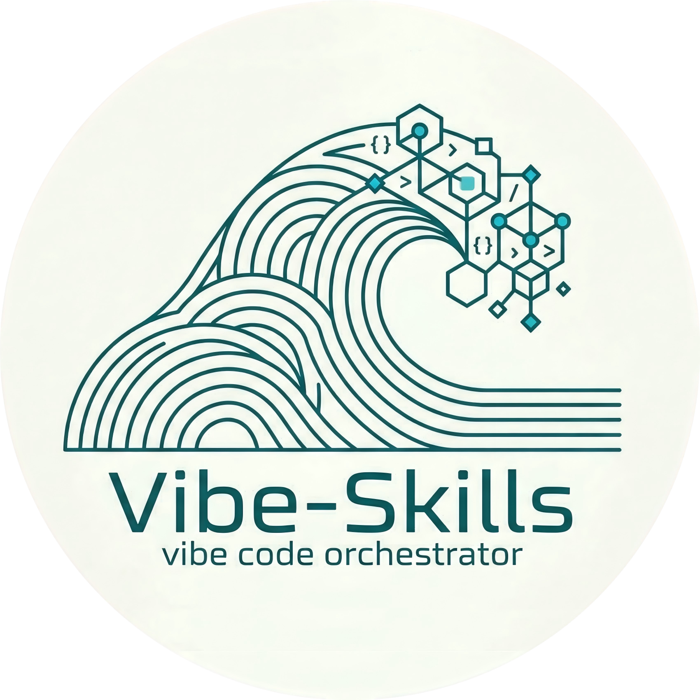

[English](./README.en.md)

# VibeSkills

> 🐙 一个把多个上游项目、数百个 skills、MCP 入口、插件能力和治理规则整合进同一运行时的 AI 能力栈。

VibeSkills 是这个仓库对外展示的名字，背后的运行时核心是 VCO。它不是单点工具，也不是只会“补代码”的技能集合，而是一套已经完成整合和治理的能力系统：目前沉淀了 340 个可直接调用的 skills 模块，吸收和借鉴了 19 个高价值上游项目与实践来源，并通过 129 条基于配置的策略、契约与规则，把 skills、MCP、插件、工作流和验证机制收进同一套可治理运行时。
> [!IMPORTANT]
> **Vibe-Skills 的核心愿景**：消除面对新技术的认知焦虑与高昂的学习成本。我们希望无论你是否具备深厚的编程基础，都能在这里以极低的门槛，无缝接入并使用当前最前沿的 AI 技术集合，让每个人都能享受 AI 带来的生产力飞跃。

  

  🧠 规划 · 🛠️ 工程 · 🤖 AI · 🔬 科研 · 🧬 生命科学 · 🎨 可视化 · 🎬 多媒体

## ✦ 这个仓库一开始就能帮你做什么

如果把这 340 个 skills 按“真实工作”而不是按“仓库目录”来看，VibeSkills 已经覆盖了从需求理解、方案设计、编码实现、测试验证，到文档沉淀、数据分析、科研支持、生命科学工具链和多媒体生成的一整条能力链。下面这张总表先给你一个可快速扫读的能力地图。

| 能力域 | 覆盖工作 | 代表能力 |
| --- | --- | --- |
| 需求洞察与问题澄清 | 把模糊想法整理成边界清晰、可验收的问题定义 | brainstorming、create-plan、speckit-clarify、aios-analyst、aios-pm |
| 产品规划与任务拆解 | 把想法拆成 spec、plan、tasks、里程碑和执行顺序 | writing-plans、speckit-specify、speckit-plan、speckit-tasks、aios-po、aios-sm |
| 架构设计与技术选型 | 设计前后端、接口、数据层、部署层与技术路线 | aios-architect、architecture-patterns、context-fundamentals、aios-master |
| 软件开发与代码实现 | 新功能开发、脚手架搭建、工程化集成和跨文件落地 | aios-dev、autonomous-builder、speckit-implement |
| 调试、修复与重构 | 定位报错、分析根因、修补行为错误并恢复可维护性 | error-resolver、debugging-strategies、systematic-debugging、deslop |
| 测试与质量保证 | 单元测试、回归验证、质量门禁、完成前核验 | tdd-guide、aios-qa、code-review、verification-before-completion |
| GitHub 与发布协作 | issue / PR、CI 修复、review comment、部署与发布 | aios-devops、gh-fix-ci、github_*、workflow_*、vercel-deploy |
| 受管工作流与多 Agent 协作 | 冻结需求、编排步骤、分派任务、留痕与 cleanup | vibe、swarm_*、task_*、agent_*、hive-mind-advanced |
| Skills 激活与能力路由 | 在正确阶段拉起正确 skill、MCP、插件和规则 | vibe、deepagent-toolchain-plan、hooks_route、semantic-router |
| MCP 与外部系统接入 | 浏览器、抓取、设计稿、第三方服务与外部上下文接入 | mcp-integration、playwright、scrapling、figma |
| 文档与知识沉淀 | README、技术文档、操作手册、图示、知识记录与报告 | docs-write、docs-review、markdown-mermaid-writing、knowledge-steward |
| 办公文档与文件处理 | Word、PDF、Excel、CSV、批注回复与格式保留 | docx、pdf、xlsx、spreadsheet、markitdown |
| 数据分析与统计建模 | EDA、回归、假设检验、可视化、清洗与统计报告 | statistical-analysis、statsmodels、scikit-learn、polars、dask |
| 机器学习与 AI 工程 | 从数据准备到训练、评估、解释、检索与实验跟踪 | senior-ml-engineer、training-machine-learning-models、shap、embedding-strategies |
| 可视化与展示表达 | 图表、交互可视化、科研图、Slides、网页展示 | plotly、matplotlib、seaborn、datavis、scientific-slides |
| 科研检索与学术写作 | 文献检索、综述整理、引用管理、论文成稿与投稿支持 | research-lookup、literature-review、citation-management、scientific-writing |
| 生命科学与生物医药 | 生信、单细胞、蛋白质、药物发现、数据库与实验平台 | biopython、scanpy、scvi-tools、alphafold-database、drugbank-database |
| 数学、优化与科学计算 | 符号推导、贝叶斯建模、多目标优化、仿真和量子计算 | math-tools、sympy、pymc-bayesian-modeling、pymoo、qiskit |
| 图像、音频、视频与内容生产 | 图片、语音、字幕、视频和多媒体素材生成 | generate-image、imagegen、speech、transcribe、video-studio |

这张表不再追求把每一列都塞满，而是先把能力面铺开，让你一眼知道仓库到底能覆盖哪些工作类型。

## 🧭 如果把这些能力再往下拆

上面的总表适合快速浏览。继续往下看，才能更准确地理解这个仓库不是“很多技能的集合”，而是一整条工作流的不同工作面。下面按更大的工作簇展开。

### 🧩 规划、架构与工程实现

- **需求洞察与问题澄清**：覆盖需求访谈、问题定义、边界识别、约束收集、成功标准和风险预判。重点不是让 AI 直接开做，而是先把问题说清楚。
- **产品规划与任务拆解**：覆盖 spec、plan、tasks、里程碑、依赖关系、优先级和交付顺序，让大想法可以被安排、被跟踪、被逐步交付。
- **架构设计与技术选型**：覆盖前端结构、后端边界、接口设计、数据层、部署层、模式选择和技术比较，尽量把返工和结构漂移压到前面解决。
- **软件开发与代码实现**：覆盖新功能开发、脚手架搭建、跨文件修改、模块整合、工程化落地和自动化实现，把计划真正落到可运行代码上。
- **调试、修复与重构**：覆盖报错定位、根因分析、行为修复、冗余清理、结构重构和可维护性恢复，不只修表面现象。
- **测试与质量保证**：覆盖单元测试、属性测试、回归验证、验收检查、质量门禁和完成前核对，让“改完能跑”升级为“有证据证明没破坏”。
- **代码评审与工程规范**：覆盖 review、风险检查、可维护性评估、安全审阅、性能提示和修改建议，把代码从“可用”往“长期可接手、可迭代”推进。

### 🔗 协作治理、路由与外部能力接入

- **GitHub、仓库协作与发布**：覆盖 issue / PR 流程、CI 修复、review comment 处理、发布分支、部署记录和上线动作，不让交付停留在本地工作区。
- **受管工作流与多 Agent 协作**：覆盖需求冻结、阶段执行、任务分派、proof、cleanup 和多 agent 协同，让复杂任务在治理框架里而不是在黑盒里完成。
- **Skills 激活与能力路由**：覆盖规则路由、语义路由、阶段触发、能力编排和沉睡能力唤起，解决“明明有很多能力，但真实任务里触发不到”的问题。
- **MCP 与外部系统接入**：覆盖浏览器自动化、网页抓取、设计稿到代码、第三方服务接入、插件入口和外部上下文获取，把分散工具收进同一运行时。
- **文档与知识沉淀**：覆盖 README、技术说明、操作手册、规范文档、Mermaid 图、知识条目和报告，让结果能够继续被团队使用，而不是留在聊天记录里。
- **办公文档与文件处理**：覆盖 Word、PDF、Excel、CSV、Markdown 转换、批注回复、格式保留和资料整理，补足真实工作里非常高频的一层。

### 🔬 数据、AI、科研与专业能力

- **数据分析与统计建模**：覆盖 EDA、回归分析、假设检验、指标体系、清洗转换、分布分析和统计报告，把原始数据整理成可解释的分析结论。
- **机器学习与 AI 工程**：覆盖模型训练、模型评估、特征工程、解释分析、embedding、RAG、实验跟踪和工作流规范化，不只是“会调模型”，而是完整的 AI 工程闭环。
- **科研检索与学术写作**：覆盖文献搜索、综述整理、引用管理、论文写作、投稿准备、审稿回复和学术规范，这一块强调的是链路完整而不是单个工具。
- **生命科学与生物医药**：覆盖生物信息学、单细胞分析、蛋白质结构、药物发现、临床试验数据、科研数据库和实验平台接入，这是仓库最有辨识度的强势区域之一。
- **数学、优化与科学计算**：覆盖符号推导、贝叶斯建模、多目标优化、仿真计算、量子计算和科学建模，适合需要精确推导和复杂建模的场景。

### 🎨 可视化、展示与内容生产

- **可视化与展示表达**：覆盖图表生成、交互可视化、科研图、演示文稿、网页展示和信息表达设计，把结果做成可读、可展示、可传播的可视成果。
- **图像、音频、视频与内容生产**：覆盖图片生成、信息图、语音合成、转写字幕、视频生产和多媒体素材整理，支持从静态视觉到音视频内容的整套制作流程。

如果把这些能力串起来看，这个仓库覆盖的其实是一条完整工作流：先理解需求，再做规划，再决定架构，再进入实现、验证、协作与发布，之后还能延伸到文档沉淀、数据分析、AI 工程、科研写作、生命科学和多媒体表达。也正因为覆盖面已经这么宽，它才更需要治理和规范化，而不是只靠“skills 数量很多”来支撑。

其中最能拉开差异的，依然是 AI 工程、科研写作和生命科学这三块。很多仓库会提到“支持机器学习”或“支持研究”，但更多只是停留在零散工具上；这里更不同的地方在于，它们已经被做成可衔接上下游的工作链，而不是彼此孤立的能力点。

## 📦 我们已经整合了哪些资源

这个仓库不是从零自造一切，而是在持续吸收成熟项目已经跑通的方法、结构和工作流。当前已经整合了 19 个高价值上游项目与实践来源，并把它们放进同一套治理体系里统一调度。

| 资源类型 | 当前沉淀 | 意义 |
| --- | --- | --- |
| Skills 与能力模块 | 340 个可直接调用的 skills / 能力模块 | 覆盖从需求、规划、编码、验证到文档、数据、科研和多媒体生成的完整工作链 |
| MCP / 插件 / 浏览器入口 | 多类外部工具接入能力 | 让外部服务、网页、设计稿、检索结果和自动化流程进入同一运行时 |
| 上游项目与方法来源 | 19 个高价值项目与实践来源 | 把成熟项目的长处吸收进统一系统，而不是让用户自己手动拼装 |
| 治理规则与契约 | 129 条基于配置的策略、契约与规则 | 约束澄清、规划、执行、验证、留痕、清理和回退，让系统长期可维护 |

项目持续整合并治理 superpower、claude-scientific-skills、get-shit-done、aios-core、OpenSpec、ralph-claude-code、SuperClaude_Framework 等优秀项目，把它们在提示组织、技能沉淀、计划驱动、治理执行、科研辅助和工程协作上的优势吸收进同一套系统里。

这也是 VibeSkills 和普通“提示词合集”或“技能目录仓库”的根本区别：这里展示的不是静态条目，而是一张已经完成整合、可被路由、可被治理、可被验证的能力网络。

## ✨ 为什么它会让人立刻感到不一样

很多 skills 仓库其实只是在回答一个问题：这里有什么能力？

VibeSkills 更在意的是另外几个问题：

- 现在该调用什么，而不是让你自己翻完整个技能表
- 应该先做什么，而不是让 AI 直接跳进执行
- 哪些能力可以安全组合，哪些地方必须设边界
- 完成之后怎么验证、怎么留痕、怎么避免长期黑盒化

它不是把能力堆得更多。
它是在把“调用、治理、验证、回看”整合成一个真正能工作的系统。

## ⚠️ 它真正解决的痛点

如果你已经在重度使用 AI，大概率已经遇到过这些问题：

- skills 太多，不知道当前场景到底该用哪个
- skills 激活率低，仓库里明明有很多能力，但真实任务里经常触发不到、想不起来、接不上流程
- 项目、插件、工作流互相重叠，也互相冲突
- AI 没澄清需求就直接开做，速度很快，方向却不稳
- 做完之后没有验证、没有证据、没有回退面
- 随着使用变深，整个工作流越来越像一个没人说得清的黑盒

VibeSkills 不是假装这些问题不存在。
它的价值就在于正面处理这些问题。

VCO 生态也在解决一个很现实的问题：不是 skills 不够多，而是很多 skills 长期处在“沉睡”状态，真实任务里激活率太低。通过路由判断、MCP / 插件入口、工作流节点编排和治理规则，系统会尽量让合适的能力在合适的阶段被真正拉起，而不是一直躺在仓库里。

## ⚙️ 它是怎么工作的

你可以把它理解成三层：

### 1. 🧠 智能路由

在合适的场景下，AI 不需要你显式记住“这次该调用哪个 skill”。

VibeSkills 会把逻辑路由和 AI 智能路由结合起来，尽量把合适的能力放到合适的场景里，让调用更自然，而不是靠你手动背技能表。VCO 生态要解决的也包括 skills 激活率低的问题，让更多能力在正确上下文和正确阶段进入执行面，而不是长期无法被真正使用。

### 2. 🧭 受管工作流

它不只是在“调工具”。
它更关心工作怎么做才稳定。

所以这套系统会尽量把需求澄清、确认、执行、验证、回顾、留痕这些步骤收进统一流程里，避免 AI 一上来就黑盒式开跑。

### 3. 🧩 整合能力

这里不只有 skills。

还有插件、项目、工作流设计、AI 规范、安全边界、长期维护经验，以及我自己在实践里踩过的坑。VCO 负责把这些能力组织成一个更统一的运行时，而不是让它们继续散落在不同角落里。

## 👥 它适合谁

VibeSkills 主要适合这几类人：

- 想让 AI 更稳定地帮自己做事的普通用户
- 已经在重度使用 AI / Agent / 自动化的进阶用户
- 想把 AI 工作流做得更规范、更可维护的个人或小团队
- 已经厌倦“技能太多但不好用”的人

如果你只是想找一个单点工具，这个仓库可能不是最轻的选择。
如果你想把 AI 用得更稳、更顺、更长期，它会更有意义。

## 🚀 开始了解它

先说明一个关键点：为了保证项目的通用代理适配性，这不是传统意义上的独立应用仓库，而是一个 **skills 格式项目**。实际使用时，应该按宿主里的 skills 调用方式来唤起它，而不是把它当作普通命令行程序直接运行。

- 在 Claude Code 里，使用 `/vibe`
- 在 Codex 里，使用 `$vibe`

如果你已经准备开始安装，再进入一步式安装入口：

- [`docs/install/one-click-install-release-copy.md`](./docs/install/one-click-install-release-copy.md)

如果你想先快速理解这套系统，再决定走哪条路径：

- [`docs/quick-start.md`](./docs/quick-start.md)
- [`docs/manifesto.md`](./docs/manifesto.md)

如果你已经是重度用户，想进一步看更完整的安装与路径说明：

- [`docs/install/recommended-full-path.md`](./docs/install/recommended-full-path.md)
- [`docs/cold-start-install-paths.md`](./docs/cold-start-install-paths.md)

## 📐 项目理念

VibeSkills 的核心要义是规范化。只有先把需求澄清、任务计划、执行、验证、留痕和回退做成可复用的秩序，人类对 AI 的描述才会更清晰，AI 的执行才会更稳定，后续维护与整体技术债才会维持在更低水平。

这个项目想做的，不是让 AI 看起来更聪明，而是让用户主要负责表达目标，后续任务在规范化工作流中被持续地落地、验证和维护，最终把真实工作里最容易失控的部分变成一个更可调用、更可治理、也更可长期维护的系统.
